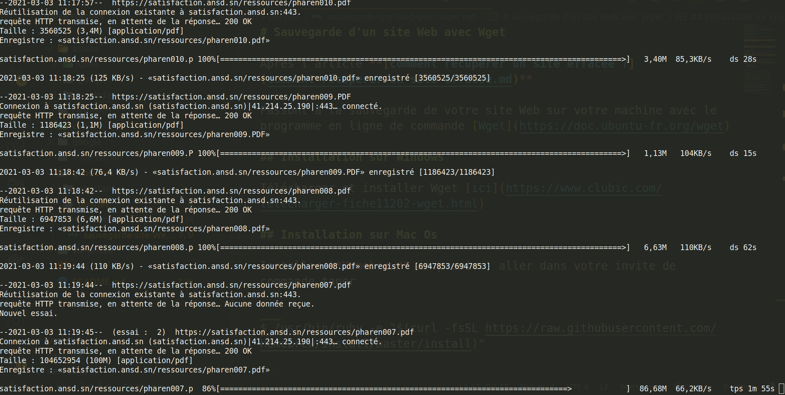

# Sauvegarde d'un site Web avec Wget

Après l'article **[comment récupérer un site effacée ?](comment-récuperer-un-site-effacee.md)**

Passons à la sauvegarde de votre site Web sur votre machine avec le programme en ligne de commande [Wget](https://doc.ubuntu-fr.org/wget)

## Installation sur Windows

Télécharger et installer Wget [ici](https://www.clubic.com/telecharger-fiche11202-wget.html)

## Installation sur Mac Os

Installer **Homebrew** en premier, aller dans votre invite de commande taper

```
$ /usr/bin/ruby -e "$(curl -fsSL https://raw.githubusercontent.com/Homebrew/install/master/install)"

```

Puis installer **Wget**

```
$ brew install wget

```

## Installation sur Linux

**Wget** est déjà disponible sur la majorité des distributions Linux, sinon aller dans votre invite de commande et taper

```
$ sudo apt install wget
```

## Comment ça marche

Facile, il vous suffit maintenant de créer un dossier, de vous positionner dans le dossier et de lancer votre commande **Wget** avec les paramètre suivant pour personnalité votre sauvegarde.

```
$ wget \
    --adjust-extension
    --mirror
    --page-requisites
    https://satisfaction.ansd.sn
```



### Les Parramétre:

* **--recursive:** télécharger l'intégralité du site Web.

* **--domains website.org:** ne suivez pas les liens en dehors de website.org.

* **--no-parent**: ne suivez pas les liens en dehors du répertoire tutorials/html/.

* **--page-requisites:** obtenir tous les éléments qui composent la page (images, CSS et ainsi de suite).

* **--html-extension:** enregistrer les fichiers avec l'extension .html.

* **--convert-links:** convertir les liens pour qu'ils fonctionnent localement, hors ligne.

* **--restrict-file-names=windows:** modifier les noms de fichiers afin qu'ils fonctionnent également sous Windows.

* **--no-clobber:** n'écrasez aucun fichier existant (utilisé en cas d'interruption et de reprise du téléchargement).

* **--adjust-extension** ajoutera les extensions correctes aux fichiers HTML et CSS. Cependant, d'autres fichiers (comme les PDF) peuvent ne pas fonctionner.

* **--mirror** adaptées à la mise en miroir d'un site.
